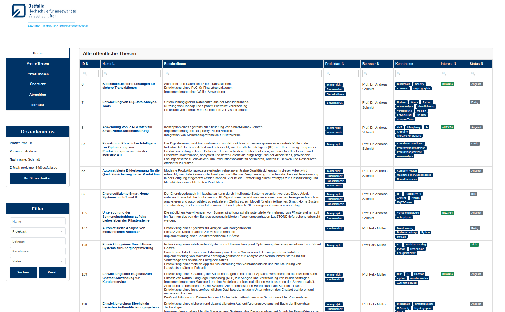
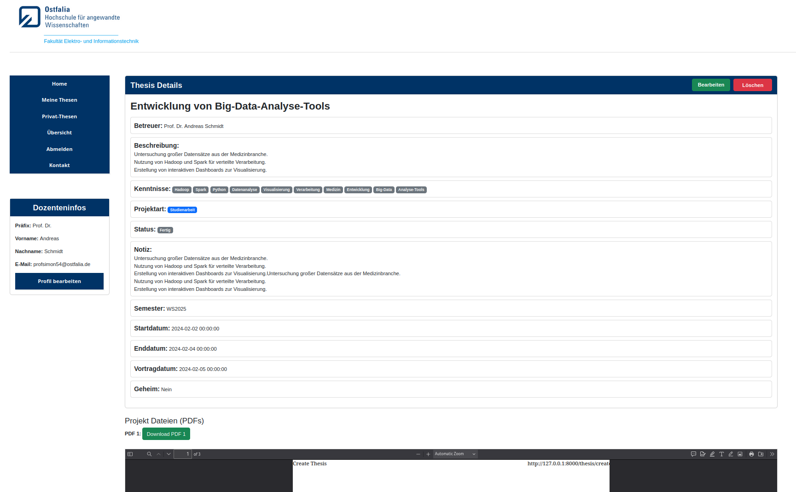
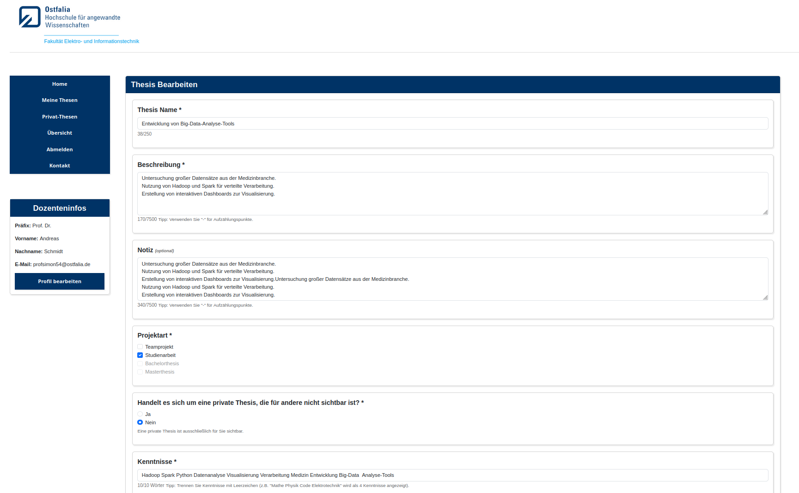
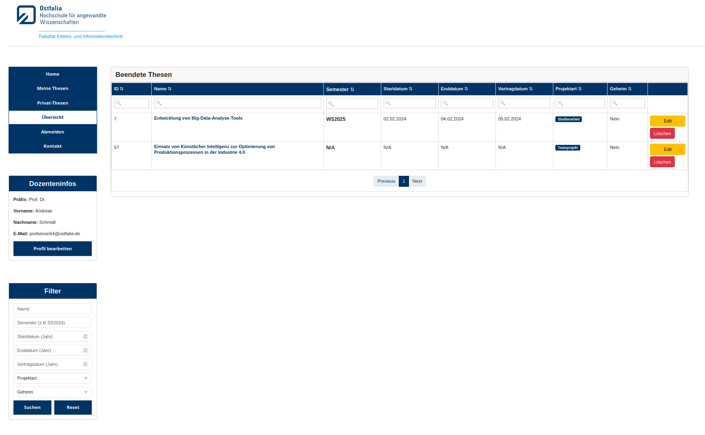

# University Thesis Management System

> Built because "send me an email for a list of topics" should never have been the system.

---

## Why We Built This

At any university, students are required to complete several academic projects throughout their studies. Yet finding the right topic has always been a manual, fragmented process.

**First**, there is no central place to discover what is available. Each professor maintains their own page with a project list — some detailed, some just *"I have projects, contact me."* Students browse dozens of pages, look for flyers in the hallway, send cold emails, and hope for a reply.

**Second — and worse** — many modules require a team. But with no shared platform, two students interested in the same topic may never find each other.

**For professors**, this means a flooded inbox — the same questions, asked repeatedly. Beyond that, the same data — topic titles, student names, dates, status — gets entered and re-entered across personal websites, spreadsheets, emails, and project management systems. Every professor has their own workaround. None of them scale.

### The Solution

One platform where professors publish topics, students discover and express interest, teammates find each other naturally, and progress tracking tool is always one click away.

A fully integrated solution — one that plugs directly into the university's existing credentials, student databases, and administrative systems — would have been ideal. But that road runs through years of cross-department bureaucratic approval. Instead, we built something lean, transparent, and deployable today: no integration required, just an Ostfalia email address to get started.

That independence comes with a tradeoff. Running outside the university's systems means no access to its user database, and no protection from its firewall. Every security decision flows from that constraint.

**Keeping it Ostfalia-only:** Ostfalia email domain as the gate, verified before first login — no @ostfalia.de, no account.

**Identity without a name:** The system extracts the Student/Staff ID from the Ostfalia email (e.g. id123456@ostfalia.de) and uses it as the sole identifier. This ID aligns perfectly with identifiers in Stud.IP and other university platforms, meaning students can find and contact each other without the system ever storing a real name.

**Privacy by design:** The system is designed to store as little sensitive data as possible. Students are encouraged to register under a pseudonym. Professors are advised not to upload sensitive data when describing projects.

**The role problem:** Since student and professor email addresses share the same format at Ostfalia, the system has no way to tell them apart automatically. To register as a Professor or Admin, users must provide an additional **internal code** — not stored anywhere public, but passed privately within the faculty's professor circle. This is a known limitation of the system, not a hidden one.

Not the best cards on the table. But every card was played deliberately.

---

## Here's what that looks like in practice.

**As a student** you land on a table of thesis topics — filterable by type, required skills, supervisor, and status. Each topic has a detail page with a full description and any PDFs the professor attached. Students can express interest and see everyone else who did the same — all identified by Student ID. 


**As a professor**, topics are published in a structured format, with the option to keep one private until ready. Once a topic is assigned, it moves through a full lifecycle — offer, active, done — with start, end, and presentation dates tracked along the way. A dedicated history page logs every supervised project, filterable by semester. The inbox doesn't go quiet, but it gets a lot quieter.

**As an admin**, full oversight of every registered user across all roles, with the ability to remove them when needed.

### Roles & Permissions

| Feature | Guest | Student | Prof | Admin |
|---------|:-----:|:-------:|:----:|:-----:|
| Browse & search thesis | ✅ | ✅ | ✅ | ✅ |
| View thesis detail | ✅ limited | ✅ | ✅ | ✅ |
| Interesse & Merkliste | ❌ | ✅ | ❌ | ❌ |
| Thesis management | ❌ | ❌ | ✅ | ❌ |
| Geheim mode | ❌ | ❌ | ✅ | ❌ |
| Thesis Management | ❌ | ❌ | ✅ | ❌ |
| User management | ❌ | ❌ | ❌ | ✅ |
| API Documentation | ❌ | ❌ | ✅ | ❌ |

---

## Screenshots

### 1. Public Theses List 
    
*Main student-facing page: searchable/filterable table of all public/open thesis topics with supervisor, skills, interest count and status*

### 2. Thesis Detail View
  
*Full thesis information including description, required skills (tags), dates, status, notes and attached PDF files*

### 3. Edit Thesis Form
  
*Form for professors to create or update a thesis: title, description, notes, project type, private mode toggle, and skill tags*

### 4. Professor's Completed Theses Overview
  
*Filtered list of finished theses with lifecycle dates, project type, private status, edit/delete buttons and pagination*


---
## Getting Started

**1. Clone the repository**

**2. Start the application**

```bash
docker compose up --build
```

> You may notice a `.env` file already present in the repository. This is intentional — it contains only dummy data, so no additional setup is needed to get started.

**3. Open in your browser**

```
http://localhost:85
```

**4. Test Accounts**

| Role | Email | Password |
|------|-------|----------|
| Admin | admin10@ostfalia.de | 123456789 |
| Professor | profsimon54@ostfalia.de | admin123 |
| Student | id123456@ostfalia.de | 12345678Aa! |

---
## Demo Mode

The repository ships in **DEMO_MODE** by default . Two things are intentionally disabled:

- **Email verification** — since you likely don't have an `@ostfalia.de` address, account activation via email (Brevo) is turned off
- **reCAPTCHA** — since test accounts are provided above, CAPTCHA challenges are disabled

These features are fully implemented and running on the production deployment. To host your own instance, three changes in `.env` are all it takes:

1. Set `DEMO_MODE=false`
2. Add your `BREVO_API_KEY`
3. Add your `RECAPTCHA_SITE_KEY` and `RECAPTCHA_SECRET_KEY`

Swap in your keys, flip the flag, and everything comes alive.

---

## Technical Overview


